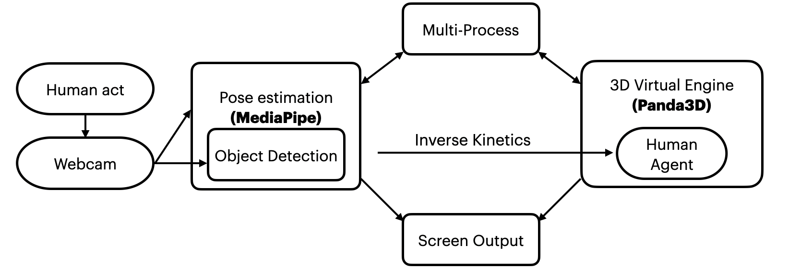
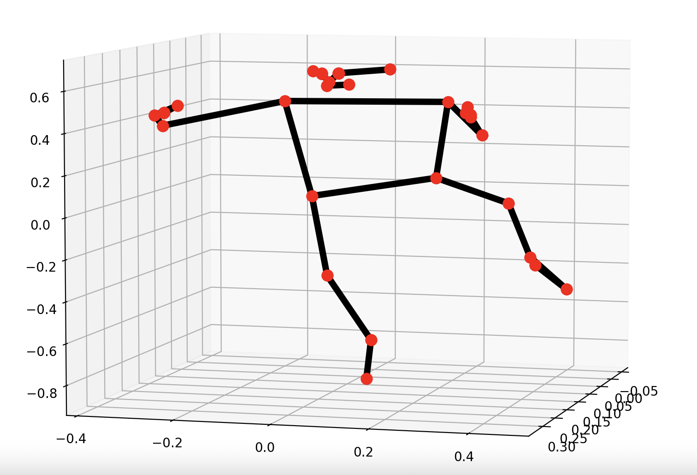
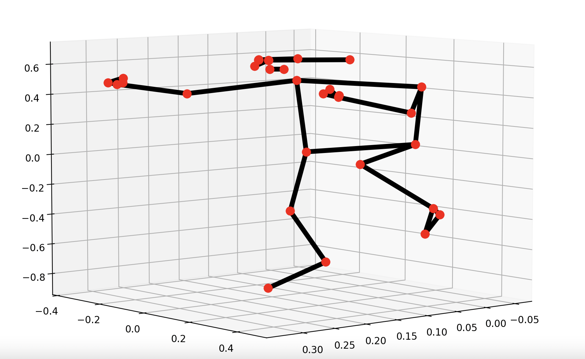
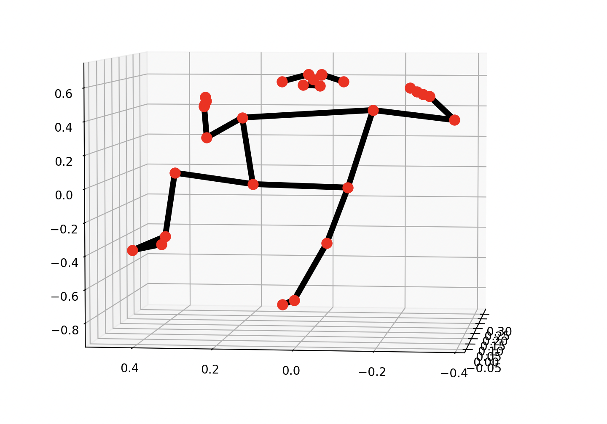
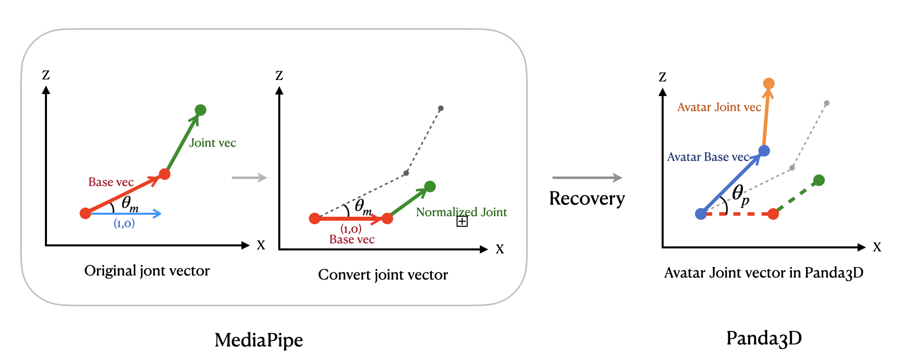

# POSE

# Project Demo

# Contents

- [POSE](#pose)
- [Contents](#contents)
- [Build Environment](#build-environment)
- [Overview](#overview)
- [CheckList](#checklist)
- [Citation](#citation)

# Build Environment

```bash
$conda create -n POSE python=3.8
$conda activate POSE
$pip install -r requirements.txt
# If you are M1 user, use this:
# $pip install mediapipe-silicon
```

# Let's Start!

## How to run our project :

```bash
$python run.py
```

## If you only want to check out the results of Pose Estimation, run :

```bash
$python pose_estimation/media.py
```

## If you only want to check out the results of panda3D engine, run :

```bash
$python Venv/PandaWithIK.py
```

# Project Architecture



- Capture the action of real people through the webcam.
- Use pose estimation to capture location of the joints.
- Using 3D engine as a platform, and built a virtual reality.

# Project Platform
- We use  RTX3090 and Ub2 22.04 to develop.
- Can be deploy on Mac M1, Win11, Jatson Nano...
- Need a webcam to capture images. (Ours: Logitech C615 HD)

# Methods
## 3D Pose Estimaiton
### Get joint position and show landmark results
By MediaPipe, we can get a Pose Estimation results of 33 joints in our body, and therefore exhibit in a 3D coordinate.
You can rotate the 3D landmark location in the coordinate to see different perspectives.
|Front View|Side View|Top View|
|--|--|--|
||||
## 3D Virtual Engine
We use Panda3D as 3D Virtual Engine, since its programs can be written in python (avoid using C#), plus, it is also lightweight and can be used on different OS. But the cons is it has no GUI and not all models can be loaded.

## Coordinate conversion between Pose Estimation and Panda3D
1. Define a “Base” vector and normalize to length = 1
    - Left upper body : Right shoulder → Left shoulder
    - Right lower body :  Left hip → Right hip
2. Find the angle between the base vector and the x-axis
3. Normalize the joint vector of each body part according to the base vector and rotate the angle



## Inverse Kinematics (IK) used in Panda3D
3D model joints that directly control panda3d are complicated.
- Coordinate axis transformation
- Dependencies between joints

With IK, the angle of the joint can be found by the end effector.
Packaged into functions and No need to rewrite in other joints.

# Future Work
- Increased accuracy and reduced latency.
- Add some art to the environment.
- Ability to interact with other virtual users or AI avatars.

# Citation / License

Thanks to Mediapipe and panda3D developers for providing us with a good development environment, so that we can stand on the shoulders of giants and make a project that satisfies us. At the same time, I would like to thank the netizens in the panda3d community for their enthusiastic responses to questions on the 3D model and GitHub for providing the basis for inverse kinematics.

The LICENSE of this github code is Apache 2.0 license, all developers are welcome to use or test our project, or provide valuable comments.
